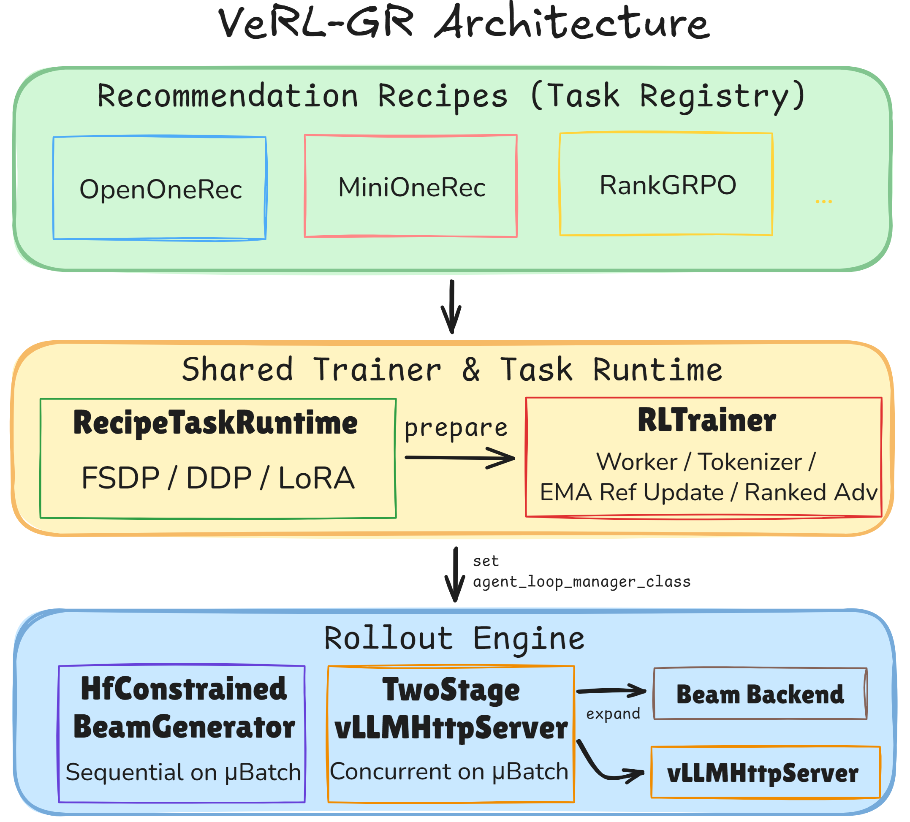

# verl-GR


<div align="center">
  
</div>

## Key Features over the Upstream VeRL

VeRL-GR offers a **programmable generation runtime** where beam width, trie constraints, two-stage KV reuse, and concurrent/async dispatch are first-class. As the generative recsys works tend to have heterogenous compute backends to accomodate different compute paradigms, we abstract the upstream [VeRL](https://github.com/verl-project/verl)'s `TaskRuntime` into a base `RecipeTaskRuntime` that can customize each recipe's actor/rollout worker strategy, lora, tokenizer/processor, and so on.


|  | Upstream VeRL | VeRL-GR |
|---|---|---|
| **Task organization** | Single `TaskRunner.run()` + dataset reward fn swap | `TASK_REGISTRY` with `RecipeTaskRuntime` hooks per recipe |
| **Rollout API** | `generate_sequences(prompts) → outputs` (vLLM/SGLang/TRT-LLM) | Same base + `two_stage` and `constrained_beam` backends registered into `_ROLLOUT_REGISTRY` |
| **Beam search** | None | `run_async_beam_search` kernel + trie constraints |
| **Catalog-valid decoding** | None | `PrefixTrieConstraint` + HF/vLLM constrained paths |
| **Two-stage generation** | None | Stage-1 reasoning + cached stage-2 beam in one async request lifecycle |
| **Advantage computation** | Token/sequence-level GAE/GRPO/PPO | + `compute_rank_grpo_advantage` — rank-slot-level GRPO |
| **Reference policy** | Frozen or hard copy | `RefSyncMixin` EMA with configurable α |
| **Trainer extensibility** | Fixed `RayPPOTrainer` lifecycle | `RLTrainer` + `TrainerTaskAdapter` delegate methods |
| **Agent loops** | Generic single-turn | Recipe-specific: two-stage metadata, constrained beam decode modes, RankGRPO concurrent gather |
| **Worker customization** | `ActorRolloutRefWorker` + backend strategy | Recipe workers: skip vLLM (MiniOneRec HF path), custom loss registration, ref sync mixin |


```
Upstream:  Prompt ──[vLLM: n=8, temp=1.0]──→ 8 independent samples

OpenOneRec: Prompt ──[Stage-1 reasoning]──→ prefix ──[beam × 32, async]──→ 32 SID candidates
MiniOneRec: Prompt ──[trie-guided beam, HF or vLLM]──→ catalog-valid SIDs
RankGRPO:   Prompt ──[vLLM n=N or concurrent n=1]──→ ranked lists → rank-slot GRPO adv
```

## Performance Records for the Recipes
* [OpenOneRec](verl_gr/recipes/openonerec/README.md)
* [MiniOneRec](verl_gr/recipes/minionerec/README.md)
* [RankGRPO](verl_gr/recipes/rankgrpo/README.md)

## Source Code Overview

- `verl_gr/recipes/`: task-specific implementations and data/reward logic (for example, OpenOneRec runtime preparation and workers).
- `verl_gr/trainers/`: trainer-side wrappers around upstream `verl` trainer code.
- `verl_gr/workers/`: rollout-side extensions that are still useful outside a single recipe.
- `verl_gr/third_party/`: small compatibility helpers for non-`verl` dependencies such as `vllm`.

## Docs

- `docs/verl_gr/openonerec_mapping.md`: maps legacy OpenOneRec runtime modules to the current `verl_gr` layout.
- `docs/verl_gr/openonerec_parity_plan.md`: tracks the current Phase B parity/smoke checklist after the cleanup refactor.
- `docs/verl_gr/minionerec_mapping.md`: MiniOneRec dataset / reward / beam contract.
- `docs/verl_gr/minionerec_pr_changes.md`: workingbranch vs `main` (MiniOneRec + performance).
- `docs/verl_gr/rankgrpo_mapping.md`: RankGRPO vs TRL root-cause comparison and analysis.
- `docs/verl_gr/rankgrpo_target.md`: alignment progress tracker by target item (convergence & efficiency).
- `scripts/README.md`: launcher index for GRPO / SFT / profiling scripts.

## Data Preparation

You will need to download `OpenOneRec/OpenOneRec-RecIF` first and then curate the RL data one-stop as follows. The flow is `OpenOneRec-RecIF -> recommendation data preprocessing -> RL data split`. Patch `verl-GR/verl_gr/recipes/openonerec/data/recif_preprocessing.sh` before getting started.

```bash
RECIF_DIR=/YOUR/RECIF/DIR
```

Then run:

```bash
cd verl-GR/verl_gr/recipes/openonerec/data
bash recif_preprocessing.sh
bash prepare_rl.sh
```

You will get the RL training data:
- `verl-GR/verl_gr/recipes/openonerec/output/rl_data/train.parquet` - Training set (remaining data after merging all tasks)
- `verl-GR/verl_gr/recipes/openonerec/output/rl_data/test.parquet` - Test set (1000 samples randomly sampled from merged data)

For Rank-GRPO data, you need to download the Reddit-V2 dataset. Or simply download the preprocessed version [here](https://drive.google.com/file/d/11tOfUMlVOylkkcnwPqGM_0IuiIeHjLle/view).

## Launching Guide

1. Install base dependencies from the official script in `requirements.txt` comments, then install pinned packages in this repo.

```bash
cd verl-GR
pip install -r requirements.txt
```

2. Run the OpenOneRec GRPO launcher (set your model path first).

```bash
cd verl-GR
export BASE_MODEL=/path/to/your/model
bash scripts/run_openonerec_grpo.sh
```

3. MiniOneRec GRPO (DDP, aligned with `MiniOneRec/rl.sh`; requires `bitsandbytes` for `paged_adamw_32bit`):

```bash
cd verl-GR
export BASE_MODEL=/path/to/your/checkpoint
export PYTHON_BIN=/path/to/vllm-gr/bin/python
bash scripts/run_minionerec_grpo_rl_aligned.sh
```

4. Rank-GRPO (set your model path first)
```bash
cd verl-GR
export BASE_MODEL=/path/to/your/checkpoint
bash scripts/run_rankgrpo.sh
```

## Two-Stage Notes

- OpenOneRec `two_stage` is implemented entirely inside `verl-GR`.
- The async path uses `verl_gr/recipes/openonerec/two_stage_agent_loop.py` together with `verl_gr/workers/rollout/two_stage_vllm_async.py`.
- No local source patch to the upstream `verl` repo is required or expected.