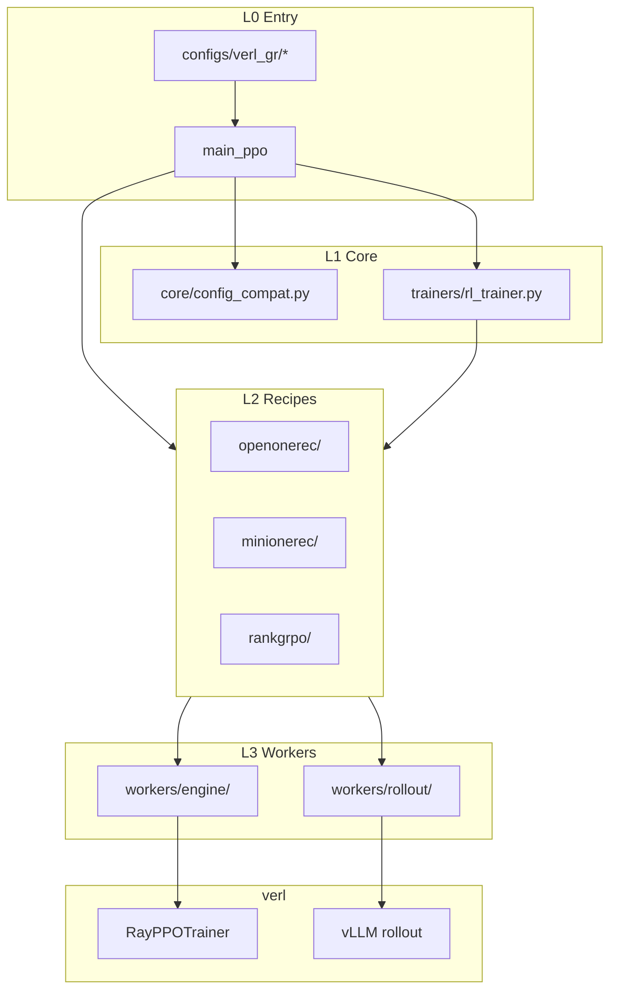

# verl-GR Architecture

This document describes the verl-GR extension layer on top of [verl](https://github.com/verl-project/verl) v0.7.1 for generative-recommendation GRPO training.

## Layered overview



## Recipe comparison

| | OpenOneRec | MiniOneRec | Rank-GRPO |
|---|---|---|---|
| Output | NL thinking + SID beam | SID constrained beam | NL ranked items |
| `rollout.name` | `two_stage` | `constrained_beam` | `vllm` |
| Engine | FSDP or DDP | DDP (default) / FSDP | FSDP only |
| LoRA | opt-in (DDP) | opt-in (DDP) | **not supported** |
| Task class | `OneRecTask` | `MiniOneRecTask` | `RankGRPOTask` |
| `prepare()` | inherits `RecipeTaskRuntime` | inherits base | **custom** (no LoRA/FSDP hooks) |

## Lifecycle model

**Startup (`RecipeTaskRuntime`):** expand rollout counts, register rollout plugins, configure LoRA/FSDP (Open/Mini only), select worker class.

**Training (`TrainerTaskAdapter`):** gen batch prep, validation, reward postprocess, checkpoint pruning. Selected via `task.trainer_adapter_class` in Hydra config.

## Decode paths (intentionally separate backends)

OpenOneRec and MiniOneRec use **different beam backends on purpose** to match their original repositories. Do not merge or abstract these into a shared implementation.

| Recipe | Backend | Rationale |
|---|---|---|
| OpenOneRec | `two_stage` → `TwoStagevLLMHttpServer` + async per-token beam | Matches OpenOneRec vLLM two-stage rollout |
| MiniOneRec | DDP: `HfConstrainedBeamGenerator` (HF `generate`) | Matches MiniOneRec `rl.sh` / TRL constrained beam |
| MiniOneRec (optional) | async `ConstrainedBeamvLLMHttpServer` | Legacy / non-primary path |

Agent loops only attach metadata; beam expansion stays in the recipe-specific backend above.

## Directory layout (after refactor)

```
verl_gr/
├── core/config_compat.py       # verl 0.7.1 Hydra backfill
├── trainers/main_ppo.py        # entry + task registry
├── recipes/
│   ├── common/collate.py
│   ├── openonerec/             # onerec_dataset, onerec_reward, onerec_task
│   ├── minionerec/
│   └── rankgrpo/
└── workers/rollout/            # beam_backend, two_stage_*, constrained_beam_*

tests/
├── smoke/                      # Hydra compose per recipe
├── core/                       # task selection
├── minionerec/ openonerec/ rankgrpo/
```

## Tests

```bash
conda activate vllm-gr
export PYTHONPATH="$(pwd):$(pwd)/../verl"
pytest tests/ -m "not gpu"

# On hk01dgx036 with GPUs 4-7:
CUDA_VISIBLE_DEVICES=4,5,6,7 bash scripts/run_tests_gpu.sh
```

See also: [verl_gr_design_diagram.md](./verl_gr_design_diagram.md) (rollout detail), [lora.md](../lora.md) (LoRA on MiniOneRec DDP), [full_training_benchmark.md](./full_training_benchmark.md) (loss + wall-clock validation).
