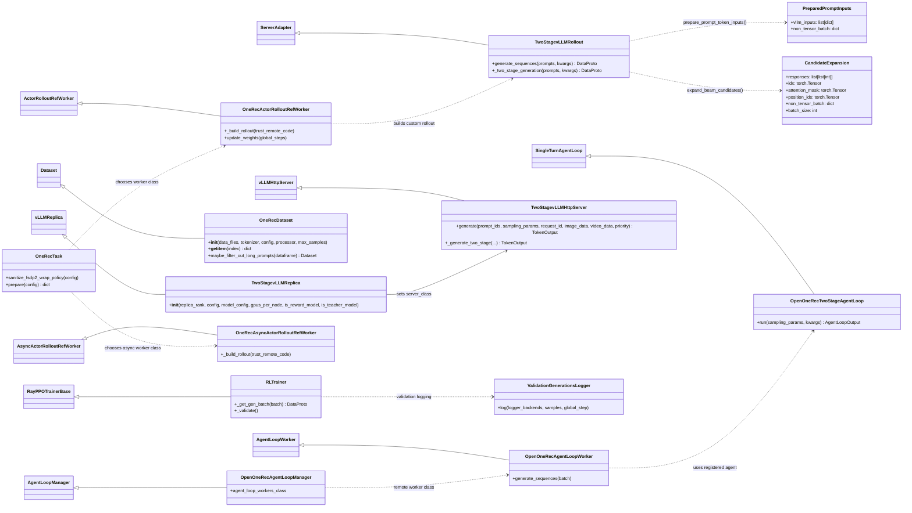

# `verl_gr` Class Diagram

## Notes

- Solid inheritance arrows show subclassing against either local or upstream `verl` classes.
- Dotted arrows indicate runtime dependency/selection (factory/registration/usage), not inheritance.
- The diagram focuses on classes under `verl_gr` and only includes external bases needed to make relationships readable.
