# `verl_gr` Design Diagram

This diagram shows how the three recipe workloads plug into the shared `verl_gr`
runtime after the recipe refactor. The main path is:

1. `verl_gr.trainers.main_ppo` selects a task runtime and builds datasets.
2. `RecipeTaskRuntime` or a recipe task prepares tokenizer, processor, worker class, and rollout registration.
3. `RLTrainer` delegates recipe-specific generation and validation through `TrainerTaskAdapter`.
4. Custom beam workloads register rollout replicas and async agent loops under `verl_gr.workers.rollout`.
   **OpenOneRec** and **MiniOneRec async** paths run beam expansion in rollout-server
   classes (`TwoStagevLLMHttpServer`, `ConstrainedBeamvLLMHttpServer`); agent loops only
   group requests and attach metadata (`beam_index`, `beam_group_id`, etc.). MiniOneRec
   DDP training additionally routes to `hf_constrained_beam_generate` on the actor worker.

```mermaid
classDiagram
direction LR

class Dataset
class ActorRolloutRefWorker
class ServerAdapter
class vLLMHttpServer
class vLLMReplica
class RayPPOTrainerBase
class TrainerTaskAdapter
class SingleTurnAgentLoop
class AgentLoopWorker
class AgentLoopManager

class TaskRunner {
  +run(config)
}
class TaskSpec {
  +name
  +factory
}
class TaskFactory {
  +build_task(config)
  +load_object(class_path)
}

class RecipeTaskRuntime {
  +sanitize_fsdp2_wrap_policy(config)
  +expand_rollout_counts(config)
  +configure_rollout(config)
  +get_actor_rollout_ref_worker(config)
  +prepare(config) dict
}

class OneRecTask {
  +expand_rollout_counts(config)
  +configure_rollout(config)
  +get_actor_rollout_ref_worker(config)
}
class MiniOneRecTask {
  +expand_rollout_counts(config)
  +configure_rollout(config)
  +get_actor_rollout_ref_worker(config)
}
class RankGRPOTask {
  +prepare(config) dict
}
RecipeTaskRuntime <|-- OneRecTask
RecipeTaskRuntime <|-- MiniOneRecTask
RecipeTaskRuntime <|-- RankGRPOTask

class OneRecDataset {
  +__init__(data_files, tokenizer, config, processor, max_samples)
  +__getitem__(index) dict
}
class MiniOneRecDataset {
  +__init__(data_files, tokenizer, config, processor, max_samples)
  +__getitem__(index) dict
}
class RankGRPODataset {
  +__init__(data_files, tokenizer, config, processor, max_samples)
  +__getitem__(index) dict
}
Dataset <|-- OneRecDataset
Dataset <|-- MiniOneRecDataset
Dataset <|-- RankGRPODataset

class RLTrainer {
  +compute_advantage(data, adv_estimator)
  +_get_task_adapter() TrainerTaskAdapter
  +_prepare_recommendation_gen_batch(batch) DataProto
  +_validate()
}
RayPPOTrainerBase <|-- RLTrainer

class OpenOneRecTrainerAdapter {
  +prepare_gen_batch(trainer, batch)
  +validate(trainer)
  +dump_generations(...)
}
class MiniOneRecTrainerAdapter {
  +prepare_gen_batch(trainer, batch)
  +postprocess_rewards(trainer, batch, reward_batch)
  +validate(trainer)
}
class RankGRPOTrainerAdapter {
  +prepare_gen_batch(trainer, batch)
  +validate(trainer)
}
TrainerTaskAdapter <|-- OpenOneRecTrainerAdapter
TrainerTaskAdapter <|-- MiniOneRecTrainerAdapter
TrainerTaskAdapter <|-- RankGRPOTrainerAdapter

class RankGRPOAlgorithm {
  +rankgrpo_enabled(config)
  +compute_rank_grpo_advantage(data, config, tokenizer)
}
class RankGRPOReward {
  +compute_score(...)
  +rank_rewards_from_text(...)
}
class RankGRPOTokenizer {
  +build_rankgrpo_tokenizer_and_processor(...)
}

class OneRecActorRolloutRefWorker {
  +init_model()
}
class MiniOneRecActorRolloutRefWorker {
  +init_model()
  +hf_constrained_beam_generate(prompts, meta_info) dict
}
class HfConstrainedBeamGenerator {
  +generate_train(model, prompts, prompt_token_ids)
  +generate_eval(model, prompts, prompt_token_ids)
}
ActorRolloutRefWorker <|-- OneRecActorRolloutRefWorker
ActorRolloutRefWorker <|-- MiniOneRecActorRolloutRefWorker

class RolloutRegistration {
  +register_two_stage_rollout_class()
  +register_two_stage_replica()
  +register_constrained_beam_rollout_class()
  +register_constrained_beam_replica()
}
class TwoStagevLLMRollout {
  +_two_stage_generation(prompts, kwargs) DataProto
  +update_weights(weights, global_steps)
}
class ConstrainedBeamvLLMRollout {
  +update_weights(weights, global_steps)
}
ServerAdapter <|-- TwoStagevLLMRollout
ServerAdapter <|-- ConstrainedBeamvLLMRollout

class TwoStagevLLMHttpServer {
  +generate(prompt_ids, sampling_params, request_id, image_data, video_data)
  +_generate_two_stage(...) TokenOutput
  +_build_two_stage_cache_entry(...) dict
  +_run_stage2_beam_search(...) list
  +abort_all_requests(reset_prefix_cache)
}
class ConstrainedBeamvLLMHttpServer {
  +generate(prompt_ids, sampling_params, request_id, image_data, video_data)
  +abort_all_requests(reset_prefix_cache)
}
vLLMHttpServer <|-- TwoStagevLLMHttpServer
vLLMHttpServer <|-- ConstrainedBeamvLLMHttpServer

class TwoStagevLLMReplica
class ConstrainedBeamvLLMReplica
vLLMReplica <|-- TwoStagevLLMReplica
vLLMReplica <|-- ConstrainedBeamvLLMReplica
TwoStagevLLMReplica ..> TwoStagevLLMHttpServer : server class
ConstrainedBeamvLLMReplica ..> ConstrainedBeamvLLMHttpServer : server class

class BeamBackend {
  +run_async_beam_search(...)
  +beam_search_score(candidate)
}
class BeamCandidate {
  +prompt_token_ids
  +generated_token_ids
  +cumulative_logprob
}
BeamBackend ..> BeamCandidate : ranks
TwoStagevLLMHttpServer ..> BeamBackend : stage2 beams
ConstrainedBeamvLLMHttpServer ..> BeamBackend : constrained beams

class OpenOneRecTwoStageAgentLoop {
  +run(sampling_params, kwargs) AgentLoopOutput
}
class OpenOneRecAgentLoopWorker {
  +generate_sequences(batch)
}
class OpenOneRecAgentLoopManager {
  +generate_sequences(prompts) DataProto
}
SingleTurnAgentLoop <|-- OpenOneRecTwoStageAgentLoop
AgentLoopWorker <|-- OpenOneRecAgentLoopWorker
AgentLoopManager <|-- OpenOneRecAgentLoopManager
OpenOneRecAgentLoopWorker ..> OpenOneRecTwoStageAgentLoop : metadata routing only
OpenOneRecTwoStageAgentLoop ..> TwoStagevLLMHttpServer : server_manager.generate

class MiniOneRecConstrainedBeamAgentLoop {
  +run(sampling_params, kwargs) AgentLoopOutput
}
class MiniOneRecConstrainedBeamAgentLoopWorker {
  +generate_sequences(batch)
}
class MiniOneRecConstrainedBeamAgentLoopManager {
  +generate_sequences(prompts) DataProto
  +_should_route_to_hf(prompts) bool
  +_hf_generate_sequences(prompts) DataProto
}
SingleTurnAgentLoop <|-- MiniOneRecConstrainedBeamAgentLoop
AgentLoopWorker <|-- MiniOneRecConstrainedBeamAgentLoopWorker
AgentLoopManager <|-- MiniOneRecConstrainedBeamAgentLoopManager
MiniOneRecConstrainedBeamAgentLoopWorker ..> MiniOneRecConstrainedBeamAgentLoop : metadata routing only
MiniOneRecConstrainedBeamAgentLoop ..> ConstrainedBeamvLLMHttpServer : server_manager.generate
MiniOneRecConstrainedBeamAgentLoopManager ..> MiniOneRecConstrainedBeamAgentLoopWorker : fallback async vLLM path

TaskRunner ..> TaskSpec : registry
TaskRunner ..> OneRecTask : openonerec
TaskRunner ..> RankGRPOTask : rankgrpo
TaskFactory ..> OneRecTask : default class path
TaskFactory ..> MiniOneRecTask : minionerec class path
TaskFactory ..> RecipeTaskRuntime : standalone loader
TaskRunner ..> RLTrainer : constructs
TaskRunner ..> OneRecDataset : create rl dataset
TaskRunner ..> MiniOneRecDataset : create rl dataset
TaskRunner ..> RankGRPODataset : create rl dataset

OneRecTask ..> RolloutRegistration : two stage
OneRecTask ..> OneRecActorRolloutRefWorker : selects
OneRecTask ..> OpenOneRecAgentLoopManager : configures rollout-server routing
OneRecActorRolloutRefWorker ..> TwoStagevLLMRollout : registers rollout engine
TwoStagevLLMRollout ..> TwoStagevLLMHttpServer : async generation dispatch
OpenOneRecAgentLoopManager ..> OpenOneRecAgentLoopWorker : dispatches grouped requests

MiniOneRecTask ..> RolloutRegistration : constrained beam
MiniOneRecTask ..> MiniOneRecActorRolloutRefWorker : selects
MiniOneRecTask ..> MiniOneRecConstrainedBeamAgentLoopManager : configures HF-first routing
MiniOneRecConstrainedBeamAgentLoopManager ..> MiniOneRecActorRolloutRefWorker : calls hf_constrained_beam_generate
MiniOneRecActorRolloutRefWorker ..> HfConstrainedBeamGenerator : constrained HF generate
MiniOneRecActorRolloutRefWorker ..> ConstrainedBeamvLLMRollout : optional async rollout registration

RankGRPOTask ..> RankGRPOTokenizer : builds tokenizer
RankGRPOTask ..> ActorRolloutRefWorker : vanilla vllm
RLTrainer ..> OpenOneRecTrainerAdapter : task adapter
RLTrainer ..> RankGRPOTrainerAdapter : task adapter
RLTrainer ..> MiniOneRecTrainerAdapter : adapter extension
RLTrainer ..> RankGRPOAlgorithm : rank advantages
RankGRPOAlgorithm ..> RankGRPOReward : per rank rewards
```

## Recipe Integration Notes

- OpenOneRec uses `OneRecTask` to expand rollout counts by beam width, register the
  `two_stage` async rollout path, select `OneRecActorRolloutRefWorker`, and wire
  `OpenOneRecAgentLoopManager`. Dataset, reward, and task runtime live in
  `verl_gr/recipes/openonerec/onerec_recipe.py`; validation and checkpoint pruning
  live in `onerec_trainer.py`.
  **Decode path (engine / rollout layer, not trainer):**
  - `OpenOneRecTwoStageAgentLoop` / `OpenOneRecAgentLoopWorker` only attach
    `stage1_sample_idx`, `beam_index`, and `beam_group_id`, then call
    `server_manager.generate(...)`.
  - Stage-1 sampling, stage-2 beam expansion, per-group cache reuse, and inflight
    throttling run in `workers/rollout/two_stage_vllm_async.py::TwoStagevLLMHttpServer`
    (`_generate_two_stage`, `_build_two_stage_cache_entry`, `_run_stage2_beam_search`).
  - Shared beam kernel: `workers/rollout/beam_backend.py::run_async_beam_search`.
- MiniOneRec uses `MiniOneRecTask` to register `constrained_beam`, select
  `MiniOneRecActorRolloutRefWorker`, and wire `MiniOneRecConstrainedBeamAgentLoopManager`.
  Dataset, reward, format helpers, worker shim, agent loop, and trainer adapter
  are separate recipe modules under `verl_gr/recipes/minionerec`.
  For DDP-aligned training, MiniOneRec agent loop routes generation to
  `hf_constrained_beam_generate` on worker side (HF `model.generate()` path);
  async constrained-vLLM remains available via rollout-server classes.
- Rank-GRPO keeps rollout on the upstream vanilla `vllm` path. Its recipe code is
  now split across `rankgrpo_dataset.py`, `rankgrpo_task.py`,
  `rankgrpo_algorithm.py`, `rankgrpo_trainer.py`, `rankgrpo_reward.py`, and
  `rankgrpo_tokenizer.py`, while `rankgrpo_recipe.py` remains a compatibility
  export module for existing config overrides.

## Shared Runtime Flow

- `main_ppo.TaskRunner` resolves a task runtime, calls `prepare(config)`, creates
  train and validation datasets through upstream `create_rl_dataset`, then builds
  `RLTrainer`. Its current in-file registry directly maps `openonerec` and
  `rankgrpo`; `task_factory.py` remains the class-path loader for config-driven
  recipe task construction such as MiniOneRec.
- `RecipeTaskRuntime` centralizes common FSDP wrap-policy cleanup, HuggingFace
  tokenizer/processor creation, worker class selection, and rollout configuration
  hooks. OpenOneRec and MiniOneRec override the rollout hooks; Rank-GRPO overrides
  `prepare` to keep its tokenizer behavior unchanged.
- `RLTrainer` owns shared recommendation generation batch preparation. It delegates
  recipe validation and generation logging through task adapters, and calls
  `rankgrpo_algorithm.compute_rank_grpo_advantage` only when
  `algorithm.rank_grpo.enable` is true.
- `verl_gr.workers.rollout` contains the reusable beam-search infrastructure:
  registration helpers, async vLLM server subclasses (`TwoStagevLLMHttpServer`,
  `ConstrainedBeamvLLMHttpServer`), rollout adapter classes, and
  `beam_backend.run_async_beam_search`. OpenOneRec and MiniOneRec async paths
  execute beam expansion in these rollout-server classes; MiniOneRec DDP training
  additionally uses `HfConstrainedBeamGenerator` on the actor worker.
  This engine-side decode layer replaces the earlier trainer-side Python beam idea.

## Diagram Legend

- Solid inheritance arrows show local classes subclassing upstream `verl` bases or
  other local abstractions.
- Dotted arrows show runtime selection, registration, delegation, or dependency
  edges rather than inheritance.
- The diagram includes external upstream bases only where they make the `verl_gr`
  class relationships easier to read.
