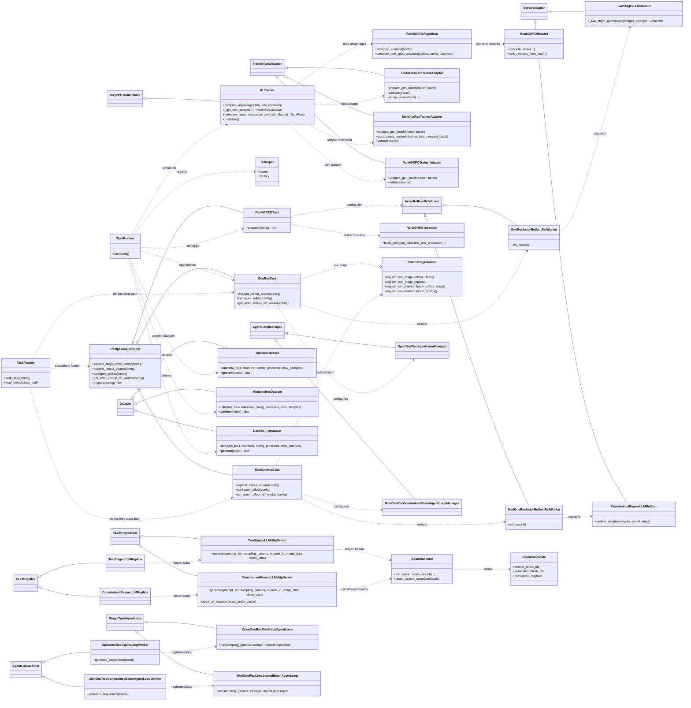

# `verl_gr` Design Diagram

This diagram shows how the three recipe workloads plug into the shared `verl_gr`
runtime after the recipe refactor. The main path is:

1. `verl_gr.trainers.main_ppo` selects a task runtime and builds datasets.
2. `RecipeTaskRuntime` or a recipe task prepares tokenizer, processor, worker class, and rollout registration.
3. `RLTrainer` delegates recipe-specific generation and validation through `TrainerTaskAdapter`.
4. Custom beam workloads register rollout replicas and async agent loops under `verl_gr.workers.rollout`.
   Beam expansion itself runs in rollout-server classes (engine side), while
   agent loops focus on request grouping and metadata routing.

## Recipe Integration Notes

- OpenOneRec uses `OneRecTask` to expand rollout counts by beam width, register the
  `two_stage` async rollout path, select `OneRecActorRolloutRefWorker`, and wire
  `OpenOneRecAgentLoopManager`. Its dataset, reward, and task runtime still live
  in `verl_gr/recipes/openonerec/onerec_recipe.py`; validation and checkpoint
  pruning live in `verl_gr/recipes/openonerec/onerec_trainer.py`.
  The two-stage beam decode is executed in
  `workers/rollout/two_stage_vllm_async.py::TwoStagevLLMHttpServer`
  (stage cache + semaphore + beam backend), not inside trainer-side Python loops.
- MiniOneRec uses `MiniOneRecTask` to register `constrained_beam`, select
  `MiniOneRecActorRolloutRefWorker`, and wire `MiniOneRecConstrainedBeamAgentLoopManager`.
  Dataset, reward, format helpers, worker shim, agent loop, and trainer adapter
  are separate recipe modules under `verl_gr/recipes/minionerec`.
  For DDP-aligned training, MiniOneRec agent loop routes generation to
  `hf_constrained_beam_generate` on worker side (HF `model.generate()` path);
  async constrained-vLLM remains available via rollout-server classes.
- Rank-GRPO keeps rollout on the upstream vanilla `vllm` path. Its recipe code is
  now split across `rankgrpo_dataset.py`, `rankgrpo_task.py`,
  `rankgrpo_algorithm.py`, `rankgrpo_trainer.py`, `rankgrpo_reward.py`, and
  `rankgrpo_tokenizer.py`, while `rankgrpo_recipe.py` remains a compatibility
  export module for existing config overrides.

## Shared Runtime Flow

- `main_ppo.TaskRunner` resolves a task runtime, calls `prepare(config)`, creates
  train and validation datasets through upstream `create_rl_dataset`, then builds
  `RLTrainer`. Its current in-file registry directly maps `openonerec` and
  `rankgrpo`; `task_factory.py` remains the class-path loader for config-driven
  recipe task construction such as MiniOneRec.
- `RecipeTaskRuntime` centralizes common FSDP wrap-policy cleanup, HuggingFace
  tokenizer/processor creation, worker class selection, and rollout configuration
  hooks. OpenOneRec and MiniOneRec override the rollout hooks; Rank-GRPO overrides
  `prepare` to keep its tokenizer behavior unchanged.
- `RLTrainer` owns shared recommendation generation batch preparation. It delegates
  recipe validation and generation logging through task adapters, and calls
  `rankgrpo_algorithm.compute_rank_grpo_advantage` only when
  `algorithm.rank_grpo.enable` is true.
- `verl_gr.workers.rollout` contains the reusable beam-search infrastructure:
  registration helpers, two async vLLM server subclasses, rollout adapter classes,
  and the shared async beam backend used by both beam-search recipes.
  This is the current performance-critical decode layer replacing the old
  high-level Python-only beam orchestration idea.

## Diagram Legend

- Solid inheritance arrows show local classes subclassing upstream `verl` bases or
  other local abstractions.
- Dotted arrows show runtime selection, registration, delegation, or dependency
  edges rather than inheritance.
- The diagram includes external upstream bases only where they make the `verl_gr`
  class relationships easier to read.
